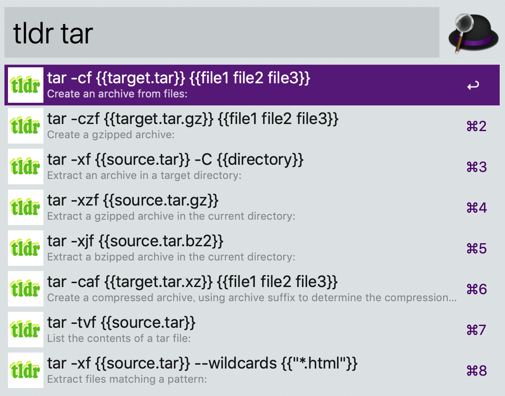
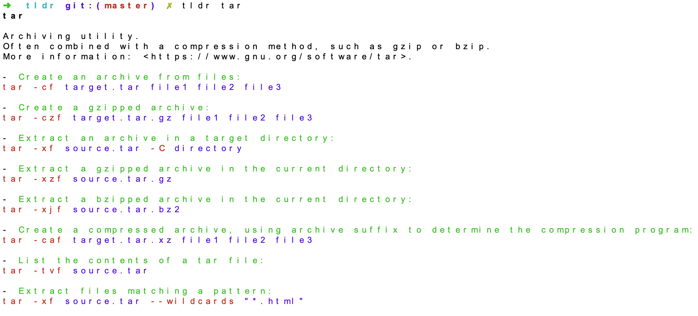

## alfred tldr
tldr alfred workflow written in go.
This tldr also works as cli.

## Install
- alfred-workflow: Download the workflow form [latest release](https://github.com/konoui/tldr/releases).
- cli: `go get -u github.com/konoui/tldr`

## Usage
- tldr `<query>` with alfred workflow

-  tldr `<cmd>` with cli

