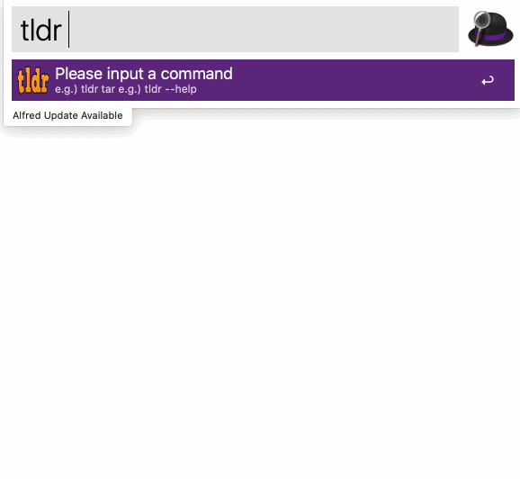

## alfred tldr

[tldr-pages](https://github.com/tldr-pages/tldr) alfred workflow written in go.



## Usage

`tldr <query>`

Options  
`--version`/`-v` option shows the current version of the client.  
`--update`/`-u` option updates local database (tldr repository).  
`--platform`/`-p` option selects platform from `linux`,`osx`,`sunos`,`windows`.  
`--language`/`-L` option selects preferred language for the page.

## Install

- Download and open the workflow with terminal for macOS.

```
$ curl -O -L https://github.com/konoui/alfred-tldr/releases/latest/download/tldr.alfredworkflow && open tldr.alfredworkflow
```

- Build the workflow on your computer.

```
$ make package
$ ls
tldr.alfredworkflow (snip)
```

## License

MIT License.

## Special Thanks

Icons are provided by [takafumi-max](https://github.com/takafumi-max)
