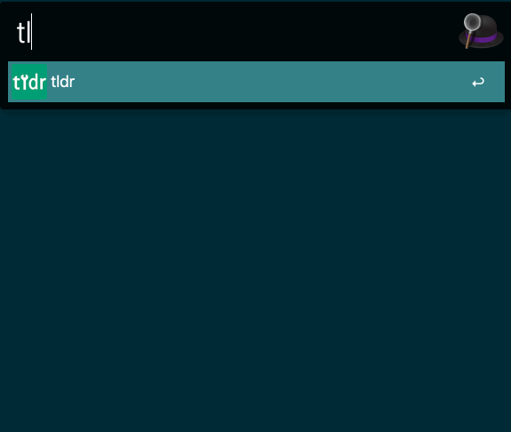

## alfred tldr
tldr alfred workflow written in go.

## Install
- Download and open the workflow with terminal for bypassing GateKeeper on macOS.
```
$ curl -O -L https://github.com/konoui/alfred-tldr/releases/latest/download/tldr.alfredworkflow && open tldr.alfredworkflow
```

- Build the workflow on your computer.
```
$ make package
$ ls
tldr.alfredworkflow (snip)
```

## Usage
`tldr <query>`

Options   
`--version`/`-v` option shows the current version of the client.   
`--update`/`-u` option updates local database (tldr repository).  
`--platform`/`-p` option selects platform from `linux`,`osx`,`sunos`,`windows`.  



## License
MIT License.
